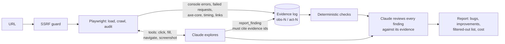

# AI App Tester

**Cypress × Playwright × Claude.** Tests your app like a person, reports like an engineer.

Point it at a web app's address. A real browser gathers evidence, Claude explores the
main flows and judges what it finds, and you get back a report a developer can act on:
what is broken, what could be better, how to reproduce each one, and how sure the
tester is that it is real.

**Live:** https://nodepulsecaringal.xyz &nbsp;·&nbsp; **API docs:** https://api.nodepulsecaringal.xyz/docs

## The problem

Small teams ship without a QA function. Testing is skipped under deadline, done ad hoc
by whoever wrote the code, or left to users. Writing and maintaining a test suite is a
project of its own, so most teams never start one, and "things that could be better"
are almost never found on purpose.

The hard part of automating this with AI is not getting a model to click around. It is
making the output trustworthy, because a report full of plausible but wrong findings
costs a developer more time than it saves.

## The approach



Split exploration from judgement, and make every claim point at evidence:

- **The browser records facts.** Crashes, console errors, failed requests, accessibility violations and broken links are captured by Playwright and reported without AI. They cannot be hallucinated.
- **Claude explores and interprets.** It decides which flows to try, uses realistic bad input, and reports what it finds, but every finding must cite the ids of the browser events that show it. Uncited findings are kept, visibly downgraded.
- **A second Claude pass reviews.** It merges duplicates and drops noise. The limits are enforced in code: it cannot invent findings, drop what the browser recorded, or promote an uncited claim. Everything it filters is still shown, with the reason.

## Repository

| Path | What it is |
| --- | --- |
| `src/` | React, TypeScript and Tailwind frontend |
| `backend-fastapi/` | Scan engine: FastAPI, Playwright, Claude API. [Details](backend-fastapi/README.md) |
| `frontend-infra/` | Terraform: S3 and CloudFront behind Cloudflare. [Details](frontend-infra/README.md) |
| `backend-infra/` | Terraform: Fargate behind an ALB behind Cloudflare, DynamoDB, S3, Secrets Manager. [Details](backend-infra/README.md) |
| `.github/workflows/` | Tested, OIDC-authenticated deploys for both halves; no long-lived AWS keys |

## Run it locally

```bash
# backend (see backend-fastapi/README.md for first-time setup)
cd backend-fastapi && uvicorn app.main:app --port 8000

# frontend, in another terminal
VITE_API_URL=http://localhost:8000 npm run dev
```

## Deliberately out of scope

- **Authenticated areas.** Scans test what an anonymous visitor can reach. Supporting logins safely means credential handling that deserves its own design.
- **Source code analysis.** It tests the running app from the outside, the way a user meets it. Reading a repository is a different tool.
- **Regression tracking across runs.** Each scan stands alone. Comparing runs and opening issues automatically is the natural next step.
- **Horizontal scale.** One task, scans in-process. A queue and workers come after there is load to justify them.
